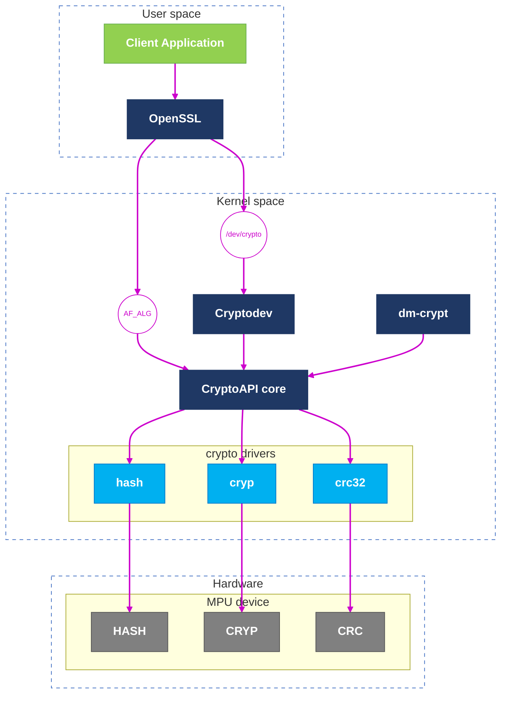

# STM32MPU Provider

Experimental OpenSSL 3 provider implementing digest algorithms through the Linux AF_ALG interface. In OpenSSL terms, a provider is a unit of code that offers implementations for operations such as digests, ciphers, signatures, and more.

This project uses:
- A custom OpenSSL provider module: `stm32_provider.so`
- Implementations through `AF_ALG`
- `libprov` for provider error helpers
- `bear` to generate `compile_commands.json` for editor integration

---

## Goals

This project aims to:

- understand OpenSSL 3 provider internals
- implement each operation supported by the provider
- connect OpenSSL digest dispatch with Linux kernel crypto through AF_ALG and cryptodev
- prepare a framework for benchmarking different crypto paths: AF_ALG, cryptodev, legacy engines, and software implementations

---

## Supported digests

Currently implemented:

- SHA-1
- SHA-224
- SHA-256
- SHA-384
- SHA-512
- SHA3-256
- SHA3-384
- SHA3-512

---

## Architecture

The project is split into clear layers:

- `prov.c`  
  provider entry point and provider dispatch table

- `digest/digest.c`  
  OpenSSL-facing digest layer (`newctx`, `init`, `update`, `final`, provider digest dispatch)

- `digest/hash_afalg.c`  
  AF_ALG-facing layer (`socket`, `bind`, `accept`, `write`, `read`)

- `include/err.h` + `err.c`  
  provider-specific error handling and reason strings

- `libprov/`  
  helper library used for provider-side error reporting

---

## Architecture diagram

## How to load the provider

OpenSSL command-line tools accept provider options such as -provider and -provider-path, and openssl list can display loaded providers, provider versions, and available algorithms.

- List loaded providers

  `openssl list -providers`
- Load this provider from the current directory

  `openssl list -provider-path . -provider stm32_provider -providers`
- List digest algorithms exposed by this provider

  `openssl list -provider-path . -provider stm32_provider -digest-algorithms`
- Verbose provider information

  `openssl list -provider-path . -provider stm32_provider -providers -verbose`

- Set the environment variable `OPENSSL_MODULES` to the directory containing the provider shared library without `-provider-path`.
  Example:

  `export OPENSSL_MODULES=$HOME/your_module_directory`

- Compute a SHA256 digest with this provider

  `openssl dgst -provider stm32_provider -propquery "provider=stm32" -sha256 /file.txt`

- Benchmark using openssl speed of SHA3-512 with this provider

  `openssl speed -provider stm32_provider -propquery "provider=stm32" -evp sha3-512`

- You can also use options such as `-seconds`, `-elapsed`, and `-bytes` to customize the benchmark. For more details, refer to the `openssl speed` documentation.

  `openssl speed -seconds 10 -elapsed -bytes 8192 -provider stm32_provider -propquery "provider=stm32" sha256`