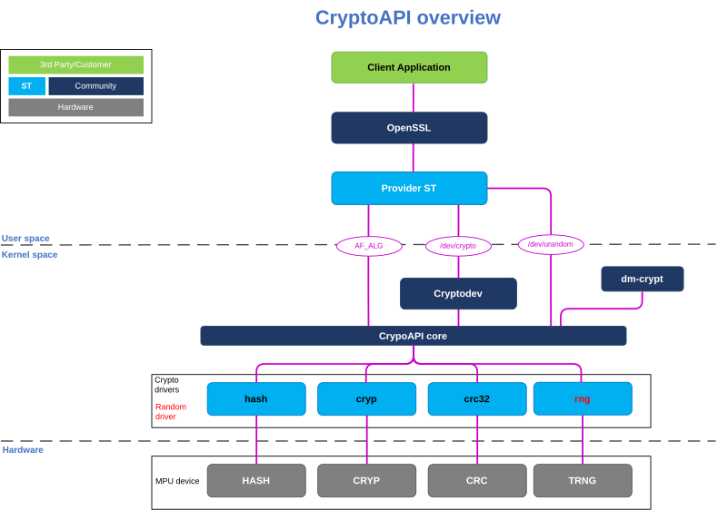

# STM32 OpenSSL Provider

In OpenSSL terms, a provider is a unit of code that offers implementations for cryptographic operations such as digests, ciphers, signatures, and more.

STM32 Provider offloads cryptographic operations for security peripherals embedded in ST MPUs, through the Linux AF_ALG and Cryptodev.

Here is a overviweuw of the CryptoAPI architecture, from User space to hardware :

## CryptoAPI overview with STM32 Provider

## Project Layout & Components

This project uses:
- A custom OpenSSL provider module: `stm32_provider.so`
- Implementations through `AF_ALG` and `Cryptodev`
- `libprov` : A helper library used for provider-side error reporting
- `include/err.h` + `err.c` : Provides provider-specific error handling and reason strings
---

### Internal Workflow

- **Entry Point (`prov.c`):** The main entry point that registers the provider and sets up the OpenSSL dispatch tables for the supported operations (Digests, Ciphers, etc.).

- **Operation Layer (`digest/`, `cipher/`):** Implements the standard OpenSSL interfaces (`newctx`, `init`, `update`, `final`) to dispatch algorithms.

- **Precompilation Switch:** A build-time configuration flag that selects the targeted Linux kernel API backend.

- **Kernel Backends:** Depending on the precompilation switch, the code utilizes dedicated source files tailored for each interface—either using Linux `AF_ALG` (e.g., `*_afalg.c`) or `Cryptodev` with `/dev/crypto` (e.g., `*_cryptodev.c`) to bridge operations like digests, ciphers, or HMACs with the kernel.

- **Hardware Acceleration:** The Linux Crypto API routes these requests directly to the dedicated **STM32 HASH or CRYP Processors** via their respective drivers.

## Current algorithm implemented

## Digest :

- SHA-1
- SHA-224
- SHA-256
- SHA-384
- SHA-512
- SHA3-256
- SHA3-384
- SHA3-512

## HMAC

- HMAC-SHA-1
- HMAC-SHA-224
- HMAC-SHA-256
- HMAC-SHA-384
- HMAC-SHA-512
- HMAC-SHA3-256
- HMAC-SHA3-384
- HMAC-SHA3-512

---

## How to load the provider

OpenSSL command-line tools accept provider options such as -provider and -provider-path, and openssl list can display loaded providers, provider versions, and available algorithms.

- List loaded providers

  `openssl list -providers`
- Load this provider from the current directory

  `openssl list -provider-path . -provider stm32_provider -providers`
- List digest algorithms exposed by this provider

  `openssl list -provider-path . -provider stm32_provider -digest-algorithms`
- Verbose provider information

  `openssl list -provider-path . -provider stm32_provider -providers -verbose`

- Set the environment variable `OPENSSL_MODULES` to the directory containing the provider shared library without `-provider-path`.
  Example:

  `export OPENSSL_MODULES=$HOME/your_module_directory`

## Do some crypto operations

### Digest :

- Compute a SHA256 digest with STM32 provider

  `openssl dgst -provider stm32_provider -propquery "provider=stm32" -sha256 /file.txt`

- Benchmark using openssl speed of SHA3-512 with STM32 provider

  `openssl speed -provider stm32_provider -propquery "provider=stm32" -evp sha3-512`

- You can also use options such as `-seconds`, `-elapsed`, and `-bytes` to customize the benchmark. 

  `openssl speed -seconds 10 -elapsed -bytes 8192 -provider stm32_provider -propquery "provider=stm32" sha256`

  For more details, refer to the `openssl speed` documentation.

  👉 https://docs.openssl.org/3.1/man1/openssl-speed/

### HMAC
  
 - Create the input file :

  `echo "This is a secret message to authenticate." > data.bin`

 - Generate a key :

  `KEY_HEX=$(openssl rand -hex 32)`

 - Compute teh HMAC :

  `openssl mac -digest SHA256 -macopt hexkey:$KEY_HEX -in data.bin -provider stm32_provider -propquery "provider=stm32" HMAC`

## Benchmark Results on STM32MP25

You can view the latest performance reports for digest : SHA-1, SHA-256, and SHA-512 here:

👉 [View Benchmark Report](https://mxvxzzz.github.io/bench-digest/)