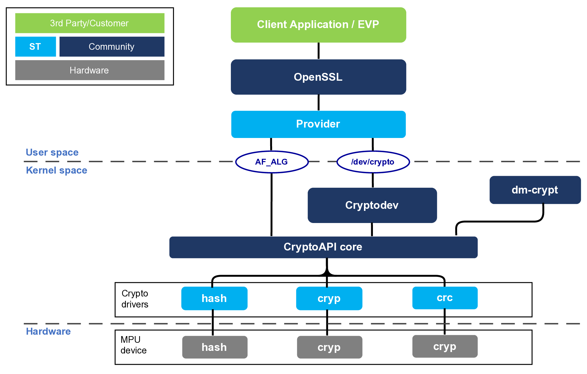

# STM32 OpenSSL Provider

In OpenSSL terms, a provider is a unit of code that offers implementations for cryptographic operations such as digests, ciphers, signatures, and more. STM32 Provider offloads cryptographic operations for security peripherals embedded in ST MPUs, through the Linux AF_ALG and Cryptodev.

## CryptoAPI overview with STM32 Provider

Here is an overview of the CryptoAPI architecture, from user space to hardware:



## Project Layout & Components

This project uses:
- A custom OpenSSL provider module: `stm32prov.so`
- Implementations through `AF_ALG` and `Cryptodev`
- `libprov`: A helper library used for provider-side error reporting
- `include/err.h` + `err.c`: Provides provider-specific error handling and reason strings
---

### Internal Workflow

- **Entry Point (`prov.c`)**: The main entry point that registers the provider and sets up the OpenSSL dispatch tables for the supported operations (Digests, Ciphers, etc.).

- **Operation Layer (`digest/`, `hmac/`, `cipher/`, `aead/`)**: Implements the standard OpenSSL interfaces (`newctx`, `init`, `update`, `final`) to dispatch algorithms.

- **Precompilation Switch**: A build-time configuration flag that selects the targeted Linux kernel API backend.

- **Kernel Backends**: Depending on the precompilation switch, the code utilizes dedicated source files tailored for each interface—either using Linux `AF_ALG` (e.g., `*_afalg.c`) or `Cryptodev` with `/dev/crypto` (e.g., `*_devcrypto.c`) to bridge operations like digests, ciphers, or HMACs with the kernel.

- **Hardware Acceleration**: The Linux Crypto API routes these requests directly to the dedicated **STM32 HASH or CRYP Processors** via their respective drivers.

## Implemented algorithms

### Digest
SHA-1, SHA-224, SHA-256, SHA-384, SHA-512,
SHA3-256, SHA3-384, SHA3-512

### HMAC
HMAC-SHA-1, HMAC-SHA-224, HMAC-SHA-256, HMAC-SHA-384,
HMAC-SHA-512, HMAC-SHA3-256, HMAC-SHA3-384, HMAC-SHA3-512

### Cipher AES
AES-128-ECB, AES-192-ECB, AES-256-ECB,
AES-128-CBC, AES-192-CBC, AES-256-CBC,
AES-128-CTR, AES-192-CTR, AES-256-CTR

### Cipher AEAD
AES-128-GCM, AES-192-GCM, AES-256-GCM,
AES-128-CCM, AES-192-CCM, AES-256-CCM

---

## Building the provider

### Prerequisites

Ensure you have the following installed:
- GCC compiler (native or cross-compiler)
- pkg-config
- OpenSSL development headers (`libcrypto`)

### Getting the sources

External dependencies are tracked as Git submodules (listed in `.gitmodules`). They must be fetched before building, otherwise the build fails:
```bash
git clone --recurse-submodules <repository-url>
# or, in an existing checkout
git submodule update --init --recursive
```

Check that every submodule is checked out (a leading `-` means it is not fetched yet):

```bash
git submodule status --recursive
```

### Cryptodev header (Cryptodev backend only)

The Cryptodev backend needs `crypto/cryptodev.h`, which is not shipped in the ST SDK. The Makefile looks for it in `warning/include/` (ignored by Git), so the SDK does not need to be modified:

```bash
git clone --depth 1 https://github.com/cryptodev-linux/cryptodev-linux.git /tmp/cryptodev-linux
install -D -m 644 /tmp/cryptodev-linux/crypto/cryptodev.h warning/include/crypto/cryptodev.h
rm -rf /tmp/cryptodev-linux
```

Ideally, use the header matching the `cryptodev` kernel module version running on the target.

### Native compilation

To compile the provider for your current platform:

```bash
make
```

Or specify the build mode:

```bash
make BUILD=dev       # Development mode (no optimization, with debug symbols)
make BUILD=release   # Release mode (optimized with -O2)
```

By default, the provider uses **AF_ALG** as the backend. To use the **Cryptodev** backend instead:

```bash
make BACKEND=cryptodev
```

### Cross-compilation with the ST OpenSTLinux SDK

Source the environment script matching the target architecture. For STM32MP1 (Cortex-A7, ARM32):

```bash
source <SDK_DIR>/environment-setup-cortexa7t2hf-neon-vfpv4-ostl-linux-gnueabi

make clean
make BACKEND=cryptodev      # or: make BACKEND=afalg
```

For STM32MP2 (Cortex-A35, AArch64), use its matching SDK environment script instead:

```bash
source <SDK_DIR>/environment-setup-cortexa35-ostl-linux

make clean
make BACKEND=afalg          # or: make BACKEND=cryptodev
```

The SDK script sets `CC` (including `--sysroot`) and `PKG_CONFIG`, so OpenSSL headers and `libcrypto` are taken from the target sysroot. Run `make clean` before switching architectures or backends: Make does not track changes to the compiler or build flags, and reusing an object file from a different target can make the linker fail with `file not recognized` or `file in wrong format`. `make clean` removes generated object and dependency files for both backends.

### Cross-compilation with another toolchain

To cross-compile the provider for a different target architecture (e.g., ARM64), set the `CC` environment variable to your cross-compiler:

```bash
# For ARMv8 (aarch64)
CC=aarch64-linux-gcc make BUILD=release

# Or with your toolchain prefix
CC=aarch64-ostl-linux-gcc make BUILD=release BACKEND=afalg
```

If `pkg-config` is not available or incorrect for the target, you may need to specify paths manually:

```bash
CC=aarch64-linux-gcc \
PKG_CONFIG=aarch64-linux-pkg-config \
CPPFLAGS="-I/path/to/target/include" \
LDFLAGS="-L/path/to/target/lib" \
make BUILD=release
```

### Output

After compilation, the shared library `stm32prov.so` will be created in the project root directory.

Check that it was built for the target architecture:

```bash
file stm32prov.so
# STM32MP1: ELF 32-bit LSB shared object, ARM, EABI5
# STM32MP2: ELF 64-bit LSB shared object, ARM aarch64
```

### Cleaning

To remove generated object and dependency files:

```bash
make clean
```

The shared library `stm32prov.so` is intentionally kept by `make clean`. Run `make clean` when switching between native and cross builds, or between backends, to avoid reusing object files built for a different architecture or backend.

---

## How to load the provider

OpenSSL command-line tools accept provider options such as `-provider` and `-provider-path`. The `openssl list` command can display loaded providers, provider versions, and available algorithms.

- **List loaded providers:**

  ```bash
  openssl list -providers
  ```

- **Load this provider from the current directory:**

  ```bash
  openssl list -provider-path . -provider stm32prov -providers
  ```

- **List digest algorithms exposed by this provider:**

  ```bash
  openssl list -provider-path . -provider stm32prov -digest-algorithms
  ```

- **Display verbose provider information:**

  ```bash
  openssl list -provider-path . -provider stm32prov -providers -verbose
  ```

- **Set the `OPENSSL_MODULES` environment variable** to the directory containing the provider shared library (alternative to `-provider-path`):

  ```bash
  export OPENSSL_MODULES=$HOME/your_module_directory
  ```

## Usage examples

### Digest

- **Compute a SHA256 digest with STM32 provider:**

  ```bash
  openssl dgst -provider stm32prov -propquery "provider=stm32" -sha256 /file.txt
  ```

- **Benchmark SHA3-512 with STM32 provider:**

  ```bash
  openssl speed -provider stm32prov -propquery "provider=stm32" -evp sha3-512
  ```

- **Customize the benchmark** with options such as `-seconds`, `-elapsed`, and `-bytes`:

  ```bash
  openssl speed -seconds 10 -elapsed -bytes 8192 -provider stm32prov -propquery "provider=stm32" sha256
  ```

  For more details, refer to the [openssl speed documentation](https://docs.openssl.org/3.1/man1/openssl-speed/).

### HMAC

- **Create the input file:**

  ```bash
  echo "This is a secret message to authenticate." > data.bin
  ```

- **Generate a key:**

  ```bash
  KEY_HEX=$(openssl rand -hex 32)
  ```

- **Compute the HMAC:**

  ```bash
  openssl mac -digest SHA256 -macopt hexkey:$KEY_HEX -in data.bin -provider stm32prov -propquery "provider=stm32" HMAC
  ```

### CIPHER AES ECB/CBC/CTR

- **Create the input file:**

  ```bash
  echo "This is a test message" > /tmp/data.bin
  ```

- **AES-192-ECB** (key size: 24 bytes / 48 hex characters)

  Generate a random key:
  ```bash
  export KEY=$(openssl rand -hex 24)
  ```

  Encrypt:
  ```bash
  openssl enc -aes-192-ecb -provider stm32prov -provider default -propquery "provider=stm32" -K $KEY -in /tmp/data.bin -out /tmp/enc_ecb.bin
  ```

  Decrypt:
  ```bash
  openssl enc -d -aes-192-ecb -provider stm32prov -provider default -propquery "provider=stm32" -K $KEY -in /tmp/enc_ecb.bin -out /tmp/dec_ecb.bin
  ```

  Verify:
  ```bash
  diff /tmp/data.bin /tmp/dec_ecb.bin && echo "OK" || echo "ERROR"
  ```

- **AES-128-CBC** (key size: 16 bytes / 32 hex characters, IV size: 16 bytes)

  Generate a random key and IV:
  ```bash
  export KEY=$(openssl rand -hex 16)
  export IV=$(openssl rand -hex 16)
  ```

  Encrypt:
  ```bash
  openssl enc -aes-128-cbc -provider stm32prov -provider default -propquery "provider=stm32" -K $KEY -iv $IV -in /tmp/data.bin -out /tmp/enc_cbc.bin
  ```

  Decrypt:
  ```bash
  openssl enc -d -aes-128-cbc -provider stm32prov -provider default -propquery "provider=stm32" -K $KEY -iv $IV -in /tmp/enc_cbc.bin -out /tmp/dec_cbc.bin
  ```

  Verify:
  ```bash
  diff /tmp/data.bin /tmp/dec_cbc.bin && echo "OK" || echo "ERROR"
  ```

- **AES-256-CTR** (key size: 32 bytes / 64 hex characters)

  Generate a random key:
  ```bash
  export KEY=$(openssl rand -hex 32)
  ```

  Encrypt:
  ```bash
  openssl enc -aes-256-ctr -provider stm32prov -provider default -propquery "provider=stm32" -K $KEY -iv $IV -in /tmp/data.bin -out /tmp/enc_ctr.bin
  ```

  Decrypt:
  ```bash
  openssl enc -d -aes-256-ctr -provider stm32prov -provider default -propquery "provider=stm32" -K $KEY -iv $IV -in /tmp/enc_ctr.bin -out /tmp/dec_ctr.bin
  ```

  Verify:
  ```bash
  diff /tmp/data.bin /tmp/dec_ctr.bin && echo "OK" || echo "ERROR"
  ```

### CIPHER AEAD GCM/CCM

The `openssl enc` command does not support AEAD ciphers such as AES-GCM or AES-CCM. OpenSSL explicitly blocks these modes in the `enc` tool because streaming CLI output cannot securely validate authentication tags before data is processed, and incorrect nonce or key reuse can lead to severe security failures.

See the [OpenSSL documentation - SUPPORTED CIPHERS](https://docs.openssl.org/3.3/man1/openssl-enc/#notes) for details.

To handle AEAD modes, OpenSSL EVP provides native support. In this project, AEAD operations are handled with the dedicated `stmaead` tool.

For detailed usage and validation examples, refer to [`aead/tools/stmaead.md`](aead/tools/stmaead.md).

## Benchmark Results on STM32MP257-EV1

See the latest performance reports:

- **Digest benchmarks**: SHA-1, SHA-256, and SHA-512
- **Cipher benchmarks**: AES ECB/CBC/CTR (128/192/256)

[View Benchmark Reports](https://mxvxzzz.github.io/stm32mpu-benchmarks/)
